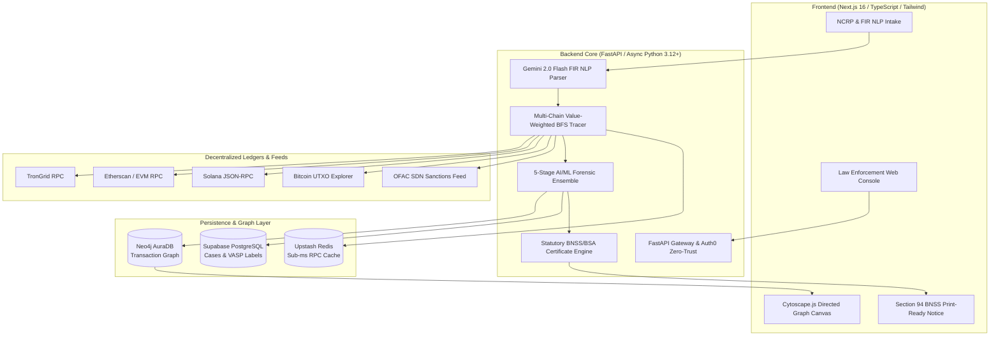

# 🛡️ ChainSleuth

### Autonomous On-Chain Threat Intelligence & Crypto Forensic Decapitation Engine
**Engineered for Federal Law Enforcement, State Cyber Crime Cells, FIU-IND & Smart India Hackathon (SIH26183)**

---

[](https://fastapi.tiangolo.com)
[](https://nextjs.org/)
[](https://www.typescriptlang.org/)
[](https://python.org)
[](https://neo4j.com)
[](https://onnxruntime.ai/)
[](https://prsindia.org)

---

## 📌 Executive Overview

When crypto fraud occurs—ranging from pig-butchering syndicates, task scams, and darknet extortion to ransomware—criminals launder illicit proceeds across burner wallets, peeling chains, smurfing fan-outs, cross-chain bridges, and privacy mixers before cashing out at Centralized Exchanges (VASPs like Binance, CoinDCX, WazirX). While syndicates complete cash-outs within **~30 minutes**, manual blockchain analysis typically takes hours or days.

**ChainSleuth** closes this operational window through end-to-end investigative automation:
1. **Intake & FIR Extraction**: Ingests suspect addresses or unstructured police FIR narratives via **Gemini AI NLP extraction**.
2. **NCRP Complaint Correlation**: Ingests and correlates complaints across state boundaries by identifying **shared gas funders** and **shared VASP deposit accounts**.
3. **Multi-Hop Graph Traversal**: Performs value-weighted BFS walks across **TRON (TRC-20 USDT)**, **Ethereum (ERC-20 & Native)**, **Solana (SPL & SOL)**, and **Bitcoin (UTXO)**.
4. **5-Stage AI/ML Threat Detection**: Deploys topological Graph Neural Networks (GraphSAGE ONNX), 4 XGBoost typology classifiers, and Isolation Forest anomaly scoring to unmask illicit structures.
5. **Actionable VASP Attribution**: Executes a **1-hop reverse step-back** to pinpoint the exact **KYC-registered deposit address** rather than pooling hot wallets, preventing invalid freeze orders.
6. **Statutory Legal Deliverables**: Auto-generates court-admissible **Section 94 BNSS Legal Freeze Directives** with cryptographic **Section 63 BSA SHA-256 Digital Evidence Certificates**.

---

## 🏗️ System Architecture



---

## 🧠 5-Stage Autonomous AI/ML Pipeline

ChainSleuth replaces naive heuristic rules with a multi-layered machine learning ensemble trained on millions of real-world blockchain transactions (Elliptic Bitcoin Dataset, BABD-13, Ethereum Fraud Ledgers):

| # | Model / Component | Engine / Format | Training Dataset | Threat Detection Role |
|---|---|---|---|---|
| **1** | **GraphSAGE GNN** | ONNX Runtime (`graphsage_risk.onnx`) | Elliptic Bitcoin Dataset (203k+ nodes) | Extracts topological structural embeddings; uncovers illicit networks even when layered across hundreds of intermediary hops. |
| **2** | **XGBoost Typology Suite** | Scikit-Learn / XGBoost 2.1.4 | BABD-13 & Ethereum Phishing Network | 4 specialized classifiers targeting: `peeling_chain`, `fan_out_smurfing`, `coinjoin_mixer`, `burner_wallet`. |
| **3** | **Isolation Forest** | Scikit-Learn | Ethereum Fraud Dataset | Unsupervised anomaly scoring (0.0 to 1.0) flagging transaction velocity bursts and synthetic bot behavior. |
| **4** | **Sanctions & Hard Forensics** | In-Memory Hash Set | OFAC SDN Dragnet & Mixer Blacklists | Real-time screening against Tornado Cash, Blender.io, Sinbad, Lazarus Group, and international terror lists. |
| **5** | **Multi-Signal Calibrator** | Calibrated Ensemble Scorer | Benchmark Validation Corpus | Generates unified 0–100 risk rating: `40% GNN + 30% Typologies + 20% Outlier Index + 10% Hard Rules`. |

---

## 🏛️ Statutory Indian Legal Compliance

Engineered specifically for Indian law enforcement agencies (State Cyber Police Stations, CID, CBI, and Enforcement Directorate):

- **Section 94 BNSS (Bharatiya Nagarik Suraksha Sanhita, 2023)**:
  Auto-generates official legal freeze notices directed to VASP Nodal Officers with statutory 72-hour KYC production demands and penal notices under Section 223 BNS.
- **Section 63 BSA (Bharatiya Sakshya Adhiniyam, 2023)**:
  Calculates a deterministic **canonical SHA-256 hash** of the complete graph traversal snapshot, ensuring tamper-proof digital evidence admissible in court.
- **First-Funder & Syndicate Correlation**:
  Tracks native gas currency (TRX/ETH/SOL) backward to identify the primary syndicate funder wallet across multiple distinct victim complaints.
- **VASP Deposit vs. Hot Wallet Resolution**:
  Distinguishes between actionable user deposit addresses (freeze targets) and omnibus exchange hot wallets (shared liquidity pools), avoiding invalid requisition orders.

---

## 📂 Repository Structure

```
chainsleuth/
├── README.md                      # Project root documentation
├── .gitignore                     # Git ignore rules
│
├── backend/                       # FastAPI Forensics Core
│   ├── app/
│   │   ├── api/                   # REST routes (trace, cases, ncrp, vasp, notices)
│   │   ├── core/                  # Configuration, Auth0 security, database pools
│   │   ├── crawler/               # Multi-chain RPC clients & BFS graph walkers
│   │   ├── models/                # GraphSAGE, XGBoost & Isolation Forest loaders
│   │   ├── schemas/               # Pydantic v2 data models
│   │   └── services/              # Legal generators, Gemini NLP & VASP resolution
│   ├── models/                    # Serialized ML artifacts (.onnx, .pkl)
│   ├── notebooks/                 # Model training and validation benchmarks
│   ├── requirements.txt           # Python dependency specifications
│   ├── supabase_schema.sql        # Relational schema for cases and audit logs
│   └── Dockerfile                 # Containerized deployment manifest
│
└── frontend/                      # Next.js 16 Investigation Console
    ├── app/                       # App Router pages (/trace, /dashboard, /ncrp, /case)
    ├── components/                # UI components, Cytoscape graph canvas, panels
    ├── lib/                       # API clients, formatters, and export utilities
    ├── public/                    # Static assets and icons
    ├── package.json               # Frontend dependencies & scripts
    └── tsconfig.json              # TypeScript configuration
```

---

## ⚡ Quick Start Guide

### Prerequisites
- **Python**: 3.12 or newer
- **Node.js**: 20.x or newer (with `npm` or `pnpm`)
- **Neo4j**: AuraDB cloud instance or local Neo4j instance
- **Supabase**: PostgreSQL project instance (optional, for persistent cases)

---

### 1. Backend Setup

```bash
# Navigate to backend directory
cd backend

# Create and activate virtual environment
python -m venv .venv
# On Windows:
.venv\Scripts\activate
# On Linux/macOS:
# source .venv/bin/activate

# Install dependencies
pip install -r requirements.txt

# Configure environment variables
cp .env.example .env
```

Configure your `.env` credentials:
```ini
# Blockchain RPCs
TRONGRID_KEY="your-trongrid-key"
ETHERSCAN_API_KEY="your-etherscan-key"

# AI / ML
GEMINI_API_KEY="your-gemini-api-key"
GEMINI_MODEL="gemini-2.0-flash"

# Databases
NEO4J_URI="neo4j+s://your-instance.databases.neo4j.io"
NEO4J_USER="neo4j"
NEO4J_PASSWORD="your-password"
SUPABASE_URL="https://your-project.supabase.co"
SUPABASE_SERVICE_ROLE_KEY="your-supabase-key"
```

Start the backend API server:
```bash
uvicorn app.main:app --reload --host 0.0.0.0 --port 8000
```
Interactive API documentation is available at `http://localhost:8000/docs`.

---

### 2. Frontend Setup

```bash
# Navigate to frontend directory
cd ../frontend

# Install dependencies
npm install

# Configure environment variables
cp .env.example .env.local
```

Set the backend API endpoint in `.env.local`:
```ini
NEXT_PUBLIC_API_URL="http://localhost:8000"
```

Start the development server:
```bash
npm run dev
```
Open [http://localhost:3000](http://localhost:3000) to view the investigation console.

---

## 📡 Core API Capabilities

| Method | Endpoint | Description |
|---|---|---|
| `POST` | `/api/v1/trace/start` | Initiates multi-hop graph traversal with ML risk scoring |
| `GET` | `/api/v1/trace/{trace_id}/graph` | Retrieves Cytoscape-formatted node and edge topology |
| `POST` | `/api/v1/ncrp/ingest` | Ingests cyber crime complaint records for cross-case correlation |
| `GET` | `/api/v1/ncrp/correlations` | Discovers shared gas funders and multi-jurisdiction syndicates |
| `GET` | `/api/v1/vasp/labels` | Resolves known VASP exchange hot wallets and deposit addresses |
| `GET` | `/api/v1/legal/notice/{case_id}` | Generates Section 94 BNSS freeze directives with Section 63 BSA hash |
| `POST` | `/api/v1/ai/parse-complaint` | Extracts suspect wallets and transaction metadata from unstructured text |

---

## 🔒 Security & Verification

- **Zero-Trust Auth0 RS256**: Key-rotated JWT verification with role-based access for investigators, supervisors, and admins.
- **Cryptographic Evidence Sealing**: Every outputted docket is stamped with a deterministic SHA-256 certificate ensuring verifiable chain of custody.
- **Air-Gapped ML Inference**: ONNX and Scikit-learn runtime inference executes locally without sending sensitive ledger data to third-party APIs.

---

## 📄 License

Distributed under the Apache 2.0 License. See `LICENSE` for more information.

---

<div align="center">
  <sub>Built with ⚖️ for Law Enforcement & Cyber Crime Investigators.</sub>
</div>
